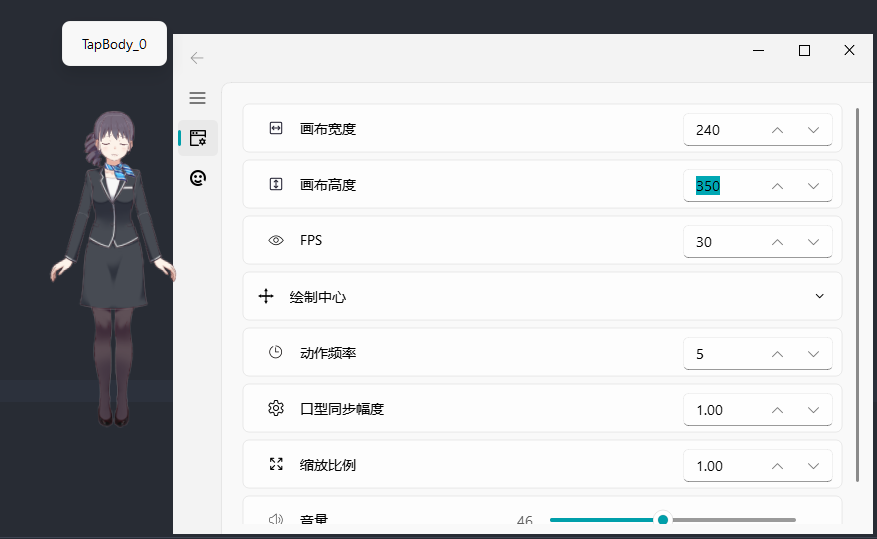

# Live2D Desktop Mascot (Python)

基于[live2d-py](https://github.com/Arkueid/live2d-py)。

在 Python 中直接加载和操作 Live2D 模型，不通过 Web Engine 等间接方式进行渲染，提供更高的自由度和拓展性。

使用 Python C API 将 Live2D Native SDK 封装为 Python 库，理论上可以在任意基于 OpenGL 的窗口上绘制 Live2D。

支持 Live2D 模型版本：
* Cubism 2.X 导出的模型：文件名格式常为 `XXX.moc`，`XXX.model.json`，`XXX.mtn`
* Cubism 3.0 及以上导出的模型：文件名格式常为 `XXX.moc3`，`XXX.model3.json`, `XXX.motion3.json` 


运行环境：Python 3.10.11 Win32

若使用 Linux 或 64 位 Python，或有其他 Python 版本需求，需要拉取 [live2d-py](https://github.com/Arkueid/live2d-py) 的源码自行编译。

**注：由于目前找到的 Cubism OpenGL 2.0 SDK 的 live2d_opengl.lib 静态库只有 32 位，加载 2.0 版本的模型只能使用 32 位。**

## 预览

2.0 版本模型：


3.0 版本模型：


## 运行

1. 安装 Python 3.10.11 （32位）

2. 安装 Python 库

```python
pip install pyside2 pyside2-fluent-widgets
```

或

```shell
pip install -r requirements.txt
```

3. 设置版本

在 [app/settings.py](./app/settings.py) 中设置 `APP_MODE` 变量和 `LIVE2D_VERSION` 变量，来配置是否打印执行信息，切换支持的 live2d 模型版本。**2.0 版本的模型目前没有打印执行信息的设置** 

4. 运行 `main.py`

