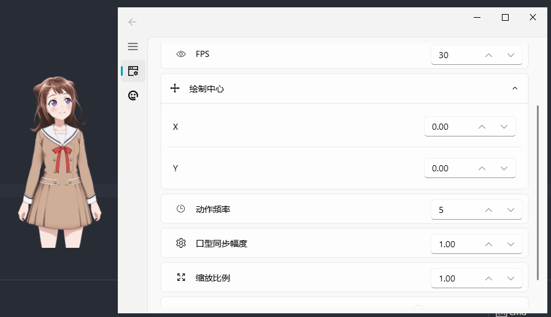

# Live2D Desktop Mascot (Python)

基于[live2d-py](https://github.com/Arkueid/live2d-py)。

支持 Live2D 模型版本：

* Cubism 2.X 导出的模型：文件名格式常为 `XXX.moc`，`XXX.model.json`，`XXX.mtn`
* Cubism 3.0 及以上导出的模型：文件名格式常为 `XXX.moc3`，`XXX.model3.json`, `XXX.motion3.json`

运行环境: Python 3.12 (Windows x64)

若使用 64 位 Python，或其他 Python 版本，需`安装/编译`对应版本的 [live2d-py](https://github.com/Arkueid/live2d-py)。

**注：由于目前找到的 Cubism OpenGL 2.0 SDK 的 live2d_opengl.lib 静态库只有 32 位，加载 2.0 版本的模型只能使用 32 位。**

=>[C++ 版本（旧版）](https://github.com/Arkueid/Live2DMascot/tree/master)

## 预览



聊天功能：


使用其他聊天接口仅需修改 [kizuna_impl.py](./framework/runtime/drive/kizuna/kizuna_impl.py) 的 `doReaction` 函数。

## 运行

### live2d 文件格式：

只要 `XXX.modelX.json` 文件路径正确即可，其他文件通过该 `json` 文件读取。

`.bak` 文件为运行时自动生成的备份文件。

Cubism 2.0 版本

```shell
Resources\v2\kasumi2
```

Cubism 3.0 及以上版本

```shell
Resources\v3\Haru
```

### 运行

1. 安装 Python 3.12 (x64)

2. 安装 Python 库

```shell
pip install -r requirements.txt
```

3. 运行 `main.py`

